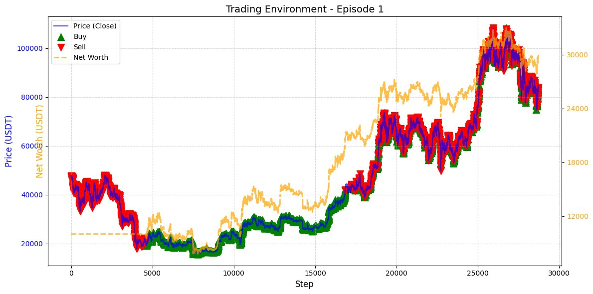

# RL-Trading: Обучение с подкреплением для алгоритмической торговли BTC/USDT  
**с немарковской моделью награды (MIL + CSC Instance Space LSTM)**

  
*Пример торговли агента A2C (Episode 1). Синяя линия — цена BTC/USDT, зелёные треугольники — покупки, красные — продажи, оранжевая пунктирная — чистая стоимость портфеля.*

---

## О проекте

**«Обучение с подкреплением в алгоритмической торговле с использованием немарковской модели награды»**

**Ключевая научная новизна:**  
Вместо классической марковской награды (только Δ капитала) используется **немарковская модель награды** на основе **Multiple Instance Learning (MIL)** и архитектуры **Concatenated Skip Connection Instance Space LSTM (CSC LSTM)**.  
Модель восстанавливает скрытое состояние агента (32-dim) и предсказывает суммарный возврат по окну траектории (20 шагов), что позволяет учитывать долгосрочные последствия сделок.

---

## Результаты (Non-Markovian RM — MIL модель)

**A2C (лучший результат)**

| Метрика              | Значение          |
|----------------------|-------------------|
| **Final Net Worth**  | **29 975.25 USDT** |
| **Total Return**     | **+199.75%**      |
| **Max Drawdown**     | **37.20%**        |
| **Volatility**       | **60.83**         |

> Агент стартовал с **10 000 USDT** и почти утроил капитал за один полный проход датасета.  
> Немарковская награда значительно превзошла марковскую версию.

---

## Основные возможности проекта

- Кастомная Gym-среда `TradingEnv` (OHLCV + RSI-14 + SMA-20)  
- Две системы наград: марковская и немарковская MIL  
- Наблюдение агента: 7 фич + 32-dim скрытое состояние LSTM  
- Сохранение/загрузка моделей (`saved_models/`)  
- Автоматические метрики + графики в `results/`  
- Подготовка траекторий и обучение MIL-модели  


---

## Установка и запуск

### 1. Зависимости
```bash
pip install -r requirements.txt
```
### 2. Подготовка данных
```python
python visualise_data.py
```

### 3. Обучение MIL-модели награды
```python
python prepare_training_data.py
python mil_reward_model/train_mil_model.py --epochs 30
```

### 4. Обучение агентов
```python
python train_and_evaluate_agents.py
```
